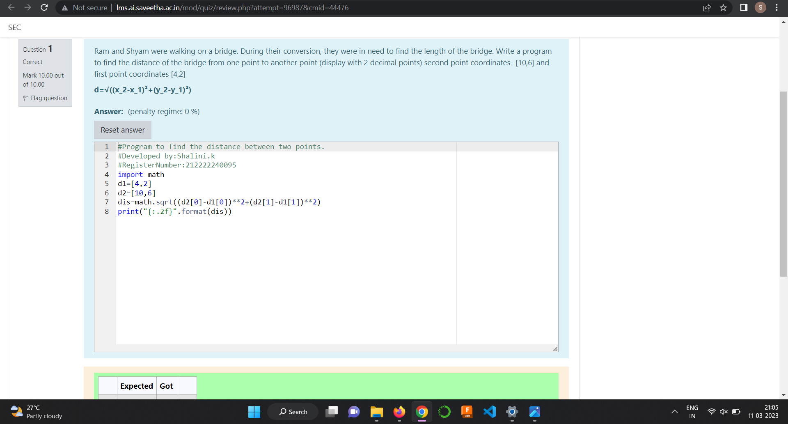
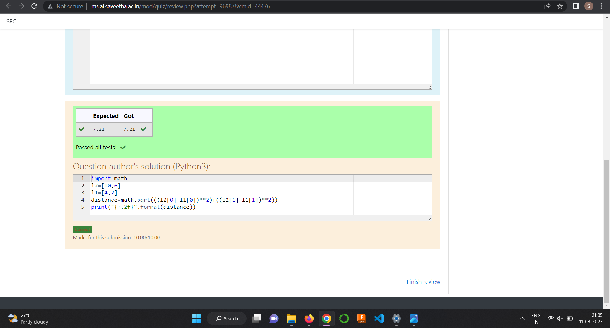

# DISTANCE-BETWEEN-TWO-POINTS

## AIM:
To write a python program to find the distance two 2 points
## ALGORITHM:
### Step 1:
import math. 
### Step 2: 
List the elements in the array.
### Step 3: 
Substitute the values in the distance formula  
### Step 4: 
Print the distance using the formula.
### Step 5: 
End the program.
### PROGRAM:
```
#Program to find the distance between two points.
#Developed by:Shalini.k 
#RegisterNumber:212222240095
import math
d1=[4,2]
d2=[10,6]
dis=math.sqrt((d2[0]-d1[0])**2+(d2[1]-d1[1])**2)
print("{:.2f}".format(dis))
```
### OUTPUT:


### RESULT:
Thus successfully created a program to find the distance between the two points
